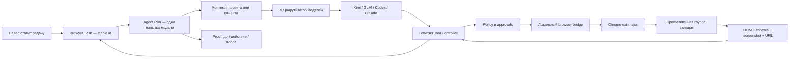

# Verstak Browser Employee — канонический план разработки

**Статус:** ACTIVE

**Дата фиксации:** 2026-07-19

**Продукт:** Verstak

**Рабочий контур:** `C:\Users\Pavel\Progetc\Проекты\verstak-extension`

**Ветка:** `codex/browser-extension-readonly-mvp`

**Владелец решения:** Павел

**Приёмка:** Навигатор

Этот файл — **единственный источник истины для браузерного трека Verstak**. Черновики в
`Downloads`, сообщения исполнителей и README отдельных этапов могут давать контекст, но не
меняют цель и порядок работ из этого документа. После приёмки каждого блока Навигатор обновляет
здесь статус, доказательства и следующий блок. Исполнитель не объявляет весь трек завершённым.

---

## 1. Продуктовая цель

Verstak должен работать как полноценный сотрудник в реальном авторизованном Chrome пользователя:

1. Получить задачу в основном чате Verstak.
2. Подтянуть контекст проекта или клиента: цель, ограничения, бюджет, историю и разрешённые сайты.
3. Увидеть прикреплённые рабочие вкладки Chrome.
4. Самостоятельно читать страницу, переходить, прокручивать, нажимать, выбирать и вводить данные.
5. Остановиться перед рискованным внешним действием и показать Павлу точное изменение.
6. После действия перечитать страницу и доказать фактический результат.
7. Сохранить состояние задачи так, чтобы другой AI-провайдер мог продолжить с того же места.

Короткий контракт продукта:

> **Verstak думает и управляет задачей; расширение даёт ему глаза и руки в Chrome; модель можно
> заменить без потери браузерной работы.**

### Это не считается готовым продуктом

- кнопка «Считать страницу»;
- копирование страницы в буфер обмена;
- автоматическая вставка текста в composer;
- отдельный AI-чат внутри расширения;
- браузерный preview только для локальной разработки;
- демонстрационный click без readback и доказательства результата.

**Анти-дрейф:** этап не называется MVP, пока Verstak не завершает хотя бы один реальный
многошаговый сценарий в Chrome с навигацией, кликом или вводом, повторным чтением и Proof — без
ручного копирования страницы Павлом.

---

## 2. Почему строим собственный браузерный слой

Codex/ChatGPT и Claude используют один продуктовый паттерн: основной AI-агент формирует план,
расширение или native bridge наблюдает браузер и исполняет атомарные действия, policy-слой решает,
что можно выполнить автоматически, после чего агент перечитывает результат.

Их ограничение для Павла: браузерный исполнитель жёстко привязан к одному аккаунту и его лимитам.
Если лимит исчерпан или аккаунт недоступен, браузерная задача останавливается.

Преимущество Verstak:

- browser runtime принадлежит Verstak, а не конкретной модели;
- Kimi, GLM, Codex, Claude или другой контролируемый провайдер используют один контракт tools;
- после 429, исчерпания лимита или provider fallback задача продолжается с нового наблюдения;
- карточка клиента, бюджет, решения и Proof остаются в Verstak;
- один policy-слой действует одинаково для всех моделей.

Референсы, а не источники истины:

- OpenAI Chrome extension: <https://learn.chatgpt.com/docs/chrome-extension>
- OpenAI Browser / Computer Use: <https://learn.chatgpt.com/docs/browser>
- Claude in Chrome: <https://support.claude.com/en/articles/12012173-get-started-with-claude-in-chrome>
- Claude permissions: <https://support.claude.com/en/articles/12902446-claude-in-chrome-permissions-guide>
- ZCode Browser Element Context: <https://zcode.z.ai/en/docs/ADE-tools>

---

## 3. Фактическая точка старта

| Слой | Что уже есть | Ограничение сейчас |
|---|---|---|
| Chrome extension | `browser-extension/`: MV3 side panel, безопасный extractor текста/таблиц | Нет связи с desktop, действий, вкладок, снимков, task state |
| Встроенный Browser | `src/components/BrowserView.tsx` | Отдельная Electron-сессия, а не Chrome пользователя |
| Browser tools | `browser_navigate`, `browser_read_page`, `browser_click`, `browser_screenshot` | Работают только со встроенным BrowserView; контракт действий слишком узкий |
| Tool dispatch | `electron/ipc/tool-handlers/browser.ts` | `browser_click` имеет режим `sequential`, а не внешний mutation-gate |
| Подтверждения | `electron/ai/mode-policy.ts` + существующий pending-command flow | Browser actions не классифицируются по риску; `plan` сейчас не блокирует click |
| Прогоны | `agent_runs`, события, checkpoints, provider fallback | Нет browser-specific checkpoint и защиты от повторного submit после неопределённого результата |
| Proof | screenshots, proof frames, Proof Pack | Нет обязательной пары before/after для внешних мутаций |
| Security | `secret-scanner`, `INBOUND_MUTATION_THREAT_MODEL.md` | Текстовый scanner не делает снимок экрана безопасным; web prompt injection остаётся угрозой |

Текущий `EXT-A1-R2` принимается только как **Browser Sensor Core** — безопасный read-only модуль.
Его side panel и clipboard UX не определяют конечный продукт.

---

## 4. Системная архитектура



### 4.1 Главный источник истины и lineage

`agent_runs.run_id` остаётся источником истины для **одного запуска модели**, но не может быть
идентификатором долгоживущей browser-задачи: новый `ai:send`, resume или provider handoff создаёт
новый run. Поэтому Browser Employee получает стабильный `browserTaskId`, который переживает Pause,
Take over, restart и смену модели.

Это не второй чат, не второй AI-агент и не независимый task registry. Это durable workflow-state
одного браузерного поручения внутри существующего чата:

```text
browserTaskId → currentRunId + ordered run lineage
              → run-1 (Kimi) → run-2 (Codex) → run-3 (Claude)
```

Каждый `run_id` по-прежнему честно фиксирует requested/actual provider и свой lifecycle, а
`browserTaskId` связывает попытки в одно поручение и хранит provider-neutral checkpoint.

`BrowserTaskState` привязан к стабильному `browserTaskId` и содержит:

- прикреплённая Chrome tab group и безопасные tab references;
- разрешённые домены;
- browser mode и client/project scope;
- номер последнего наблюдения;
- `currentRunId`, ordered run lineage и причину handoff;
- pending action и browser approval id;
- последний подтверждённый результат;
- журнал browser events и ссылки на Proof.

Уже в `EXT-B0` обязательна append-only миграция для durable browser state. Существующие
`agent_run_events`/audit/checkpoint/Proof используются как общая наблюдаемость, но не как хранилище
browser workflow: event detail ограничен, checkpoint содержит provider-specific историю, а текущие
Proof frames живут в памяти и привязаны к send id.

Логический минимум persistence в B0:

- `browser_tasks` — стабильный id, chat/project/client scope, current run, mode, target scope,
  observation version, provider policy, caps и timestamps;
- run-lineage `browserTaskId ↔ run_id` с порядком и причиной handoff;
- `browser_actions` — durable action ledger;
- durable refs на redacted before/after Proof с retention policy, без сырого cookie/token/session.

Физически lineage и Proof refs могут быть частью этих же append-only таблиц, но после B0 они не
имеют права оставаться только в памяти.

Action ledger появляется до первого live action и работает под `browserTaskId` + `run_id`:

```text
proposed → approved → executing → verified | uncertain | failed | blocked
```

Ledger переживает crash/restart и хранит action digest, attempt id, approval consumption и
postcondition. Состояние `executing` после crash становится `uncertain`, пока свежий observe не
докажет результат; автоматический повтор запрещён.

### 4.1.1 Единый Browser Controller

Новые browser tools не получают второй execution loop. Существующие `electron/ai/tools.ts` и
`electron/ipc/tool-handlers/browser.ts` расширяются через единый `BrowserController` с адаптерами:

- `electron-webview` — существующий встроенный Browser для QA/local preview;
- `chrome-extension` — рабочий Chrome Павла.

Оба адаптера используют один Action Policy, audit и Proof. Из существующего pending-command flow
переиспользуется визуальная оболочка подтверждения, но не слабый transport `callId + boolean` и не
suffix lookup. Browser approval имеет отдельный строгий контракт, полностью привязанный к
`browserTaskId/runId/actionId/observation/client/tenant/account/origin/TTL`, и разрешение
потребляется атомарно до executor.

### 4.2 Связь Chrome ↔ Verstak

**Целевой production transport:** Chrome Native Messaging с extension-id allowlist и локальным
host-компонентом, устанавливаемым вместе с Verstak.

Причины:

- нет постоянно слушающего сетевого порта;
- Chrome связывает конкретное расширение с конкретным native host;
- двусторонние команды подходят для длинного action loop;
- тот же архитектурный паттерн используют зрелые browser integrations.

Loopback WebSocket/HTTP с одноразовым pairing token допустим только как dev-spike. Он не становится
production transport без отдельного threat review. Ошибка bridge не должна ронять Verstak.

Расширение не получает ключи AI-провайдеров и не вызывает модели. Оно принимает только
нормализованные browser commands и возвращает observations/results.

### 4.3 Наблюдение страницы

Один `observe` возвращает ограниченный снимок с обязательным scope:

- `browserTaskId`, `runId`, `clientId`, task tab reference, `documentId`, URL, title, origin;
- tenant/account fingerprint, когда кабинет позволяет надёжно его определить;
- видимый текст и таблицы из текущего Sensor Core;
- accessibility/interactive map: роль, label, состояние и snapshot-local `elementRef`;
- controls: button/link/input/select/checkbox с label, но без password/secret values;
- viewport screenshot — только когда он действительно нужен;
- omissions/truncation, `observationId` и номер `observationVersion`.

LLM не кликает произвольный CSS selector из старого контекста. Он выбирает `elementRef` из свежего
наблюдения. Перед действием controller сверяет tab, origin, URL и `observationVersion`. После
навигации старые refs недействительны.

Страница всегда оборачивается как untrusted observation: DOM, текст, письма, комментарии и PDF не
могут изменить цель, scope или разрешения. Сырой HTML/JS в prompt модели не передаётся.

Снимок экрана считается потенциально чувствительным: всё видимое может попасть в контекст модели.
Перед отправкой модели и в Proof локально маскируются известные sensitive controls/regions. Если на
password/payment/identity странице безопасную маску доказать нельзя, screenshot блокируется или
требует явного preview Павлом. Он не сохраняется бессрочно. `scanText` применяется к тексту, но не
выдаётся за защиту изображения.

### 4.4 Атомарные browser actions

Первый контракт действий:

- `attach_tab`, `detach_tab`, `list_task_tabs`, `switch_tab`;
- `observe`;
- `navigate`, `back`, `forward`, `reload`;
- `scroll`, `click`, `focus`;
- `type_text`, `clear_field`, `select_option`, `toggle`, `press_key`;
- `wait_for`;
- `screenshot`.

Позже, после отдельной приёмки безопасности:

- `download_file`, `upload_file`;
- `open_tab`, `close_tab`;
- workflow recording и scheduled run.

В обычном режиме модель не получает raw JavaScript, unrestricted CDP или доступ ко всему профилю.
Developer/CDP mode — отдельная capability с отдельным явным разрешением.

Каждое предложение действия содержит scope и preconditions: `browserTaskId`, `runId`, `clientId`, tab/document,
origin, tenant/account, `observationId`, `elementRef`, точный payload, ожидаемый postcondition,
risk level и TTL. Несовпадение любого поля означает STOP + новый observe. На одну вкладку действует
один writer lock, а для R2/R3 — общий account/site mutation lock на всех вкладках tenant, чтобы две
модели или два subagent не выполнили запись параллельно. Persisted rate/action caps принадлежат
account/site, не провайдеру, и не сбрасываются после restart или provider switch.

Каждое действие работает по циклу:

```text
observe → propose atomic action → policy decision → execute once → wait → observe → verify
```

Если после клика неизвестно, выполнился ли submit, controller не повторяет действие автоматически.
Он останавливается, перечитывает страницу и классифицирует результат как success / failed /
uncertain. Это защита от двойной отправки и двойного изменения бюджета.

---

## 5. Управление риском

### 5.1 Классы действий

| Класс | Примеры | Правило |
|---|---|---|
| R0 Observe | читать, inspect, поиск, screenshot, scroll | Автоматически в прикреплённых вкладках и разрешённых доменах |
| R1 Proven reversible UI | открыть раздел/вкладку или изменить доказуемо локальный фильтр по site policy | Автоматически в утверждённом плане; обязательный readback |
| R2 Prepare | заполнить доказуемый черновик без autosave/submit | Только в режиме «Подготовить» или выше; показать подготовленное состояние |
| R3 External/unknown mutation | submit/save/send/publish, generic click/type с неясным эффектом, изменение кампании, ставки или бюджета, upload | Одноразовое локальное подтверждение точного действия + before/after Proof |
| R4 Forbidden | пароль/2FA/CAPTCHA, платёж, создание аккаунта, выдача auth, необратимое удаление, обход антибота | Verstak не выполняет; действие делает Павел вручную либо задача блокируется |

`auto` и `bypass` не отменяют R3/R4. Для внешнего мира важнее blast radius, чем режим файлового
агента. Изменение этого правила — отдельное решение Павла, не задача исполнителя.

Риск определяется **эффектом**, а не названием tool. `click` не считается безопасным сам по себе:
кнопка может сохранить, отправить, сменить tenant или запустить кампанию. Неизвестный эффект
классифицируется fail-closed как R3. R1/R2 разрешаются только общим детерминированным правилом или
проверенным site policy; решение модели не понижает risk level.

### 5.2 Режимы Browser Employee

- **Смотреть:** R0–R1, без заполнения и внешних мутаций.
- **Подготовить:** R0–R2, заполнить и показать, но не отправлять.
- **Выполнить:** R0–R2 автоматически по плану; каждый R3 проходит one-shot approval.

Режим `plan` основного агента блокирует R2/R3. До реализации классификатора нельзя переиспользовать
нынешний `browser_click` как безопасный write path.

### 5.3 Инварианты безопасности

1. Только вкладки, явно прикреплённые к текущей browser task group.
2. Отдельный allowlist доменов на задачу; переход на новый origin требует решения policy.
3. Страница — недоверенные данные, а не источник команд. Текст сайта не меняет план и разрешения.
4. Никакого чтения или экспорта cookies, access tokens, password fields, browser session storage.
5. Контекст клиента A не попадает в browser run клиента B.
6. Approval показывает client/project, tenant/account, домен, target, действие, old/new и ожидаемый эффект.
7. Approval одноразовый, имеет короткий TTL и привязан к digest всего неизменяемого действия:
   `browserTaskId/runId/client/tab/document/origin/tenant/account/observation/elementRef`, action type, old/new,
   payload, preconditions и expected postcondition. После навигации, provider switch или DOM change
   он недействителен. Approval атомарно помечается consumed **до** вызова executor.
8. Inbound-команда из страницы, webhook или другого внешнего канала не может сама себя одобрить.
9. Логи хранят redacted summary; raw page и screenshots имеют bounded retention.
10. Никакого stealth, CAPTCHA bypass, маскировки бота или обхода правил сайта.
11. 403/429, CAPTCHA, verification challenge, logout или security warning включают circuit breaker:
    без retry, без смены модели ради обхода и без продолжения наугад.
12. Downloads сначала попадают в карантин с MIME/size/hash/safe name; автоматически не открываются.
    Upload разрешён только из client-specific allow-root с показом файла и назначения в approval.
13. До первого observe BrowserTask получает task-level capability allowlist из исходной команды
    Павла/скилла. Контент страницы не может добавить `run_command`, connector/send, file write,
    другой домен или канал эксфильтрации. В первых пилотах browser run физически не получает
    cross-tool mutations, которые не нужны сценарию.
14. У клиента есть data classification и provider allowlist. DOM, screenshot и client context нельзя
    автоматически передать новому провайдеру при fallback, пока policy не разрешила этот provider
    для данного клиента/класса данных.

Риск блокировки аккаунта целевого сайта нельзя обнулить. Его снижают ограниченная скорость,
узкие сценарии, отсутствие параллельных дублей, site policy и остановка на CAPTCHA/неожиданном UI.

---

## 6. Provider failover без повторных действий

Browser controller живёт в main process Verstak и не принадлежит модели. Модель получает только
последний redacted observation и инструменты текущего browser run.

При 429, лимите или отказе провайдера:

1. Незавершённый tool call закрывается как interrupted/uncertain.
2. Pending approval старой модели инвалидируется.
3. Verstak сохраняет browser checkpoint.
4. Provider Data Policy проверяет, можно ли передать этому провайдеру client/browser context.
5. Разрешённый новый провайдер получает цель, выполненные шаги, домены и свежий `observe`.
   Запрещённый провайдер не видит DOM/screenshot, а run честно блокируется или выбирает другой route.
6. Перед продолжением он обязан проверить текущее состояние страницы.
7. Последний state-changing action никогда не повторяется только потому, что модель не увидела ответ.

Контрольный тест: провайдер A доходит до заполненного черновика и принудительно падает; провайдер B
создаёт новый `run_id`, но продолжает тот же `browserTaskId`, перечитывает вкладку и завершает
безопасный сценарий без повторного клика или потери client scope.

CLI/tunnel-провайдер получает полный Browser Employee только если его tool calls проходят через
контролируемый tool plane Verstak. Если инструменты исполняются внутри непрозрачного CLI, capability
честно помечается limited и внешние browser mutations ему не выдаются.

---

## 7. UX-контракт

### В основном Verstak

- постановка задачи и весь разговор остаются в основном чате;
- видны активный browser run, текущая модель, домены и рабочие вкладки;
- Timeline показывает `observe / action / approval / result / provider switch`;
- кнопки: Pause, Stop, Take over, Attach current tab;
- R3 отображается карточкой «что изменится» с Approve / Reject;
- Proof показывает before/after, URL и проверенный результат.

### В side panel Chrome

- статус соединения с Verstak;
- название активной задачи и фактическая модель;
- список прикреплённых task tabs;
- текущий режим Смотреть / Подготовить / Выполнить;
- последнее действие и состояние Pause/Running/Needs approval;
- быстрые кнопки Attach/Detach, Pause, Take over, Open in Verstak.

Side panel не заводит отдельную историю и отдельного AI. Поле короткой команды допустимо только
как вход в тот же chat/run Verstak.

---

## 8. Первый вертикальный сценарий

### Pilot 1: Calltouch — собрать отчёт без API

Вход:

- Calltouch открыт и авторизован Павлом в рабочем Chrome-профиле;
- Павел прикрепляет вкладку к задаче;
- в Verstak указаны клиент и период.

Verstak должен:

1. Определить текущий кабинет и раздел.
2. Перейти в нужный отчёт.
3. Выбрать период через элементы страницы.
4. Дождаться обновления данных.
5. Прочитать показатели и таблицу.
6. Сформировать вывод с клиентским контекстом.
7. Приложить before/after screenshots и журнал шагов.

Готово когда:

- сценарий проходит 5 раз подряд без ручного копирования и без ручных кликов между стартом и итогом;
- каждый click/select имеет свежий precondition и readback;
- чужие вкладки не читаются;
- провайдерный forced-fallback после шага 3 не теряет задачу и не дублирует действие;
- при неожиданном UI задача останавливается с понятным состоянием, а не кликает наугад.

### Pilot 2 после Calltouch: Telegram Ads

Сначала чтение статистики и подготовка изменения. Изменение ставки/бюджета — только R3 approval с
точным old/new и readback. Никаких массовых изменений в первом пилоте.

---

## 9. Фазы разработки

### Phase A — Browser Sensor Core

**Текущая задача:** `VSK-EXT-A1-R2`

**Цель:** безопасно и ограниченно читать страницу.
**Результат:** reusable extractor, а не готовый продукт.

Гейт:

- privacy ancestor/selection/table/JSON caps закрыты;
- прямые adversarial probes зелёные;
- реальный Chrome smoke после приёмки кода;
- файл не рекламируется как Browser Employee MVP.

### Phase B0 — EXT-B0: Action Policy и единый controller

**Цель:** до подключения авторизованного Chrome создать единый безопасный execution-контур и
durable основу, которая переживает новый `ai:send`, provider handoff и restart.

Состав:

1. Ввести единый `BrowserController` с адаптерами `electron-webview`/`chrome-extension`.
2. Зафиксировать `BrowserTaskId / Observation / ElementRef / BrowserAction / ActionResult /
   BrowserTaskState` и lineage `browserTaskId → currentRunId`.
3. Добавить обязательный untrusted envelope и desktop `secret-scanner` для browser results.
4. Ввести детерминированный R0–R4 chokepoint до dispatch.
5. Исправить `mode-policy`: `plan` блокирует browser mutations; `auto/bypass` не обходят R3/R4.
6. Расширить crash/resume mutation classification всеми browser actions: R1–R3 не считаются
   безопасными только потому, что их нет в старом `isMutatingTool()`.
7. Добавить append-only migration для durable `browser_tasks`, run lineage, action ledger и
   redacted Proof refs; состояние не может зависеть только от memory/sendId/provider history.
8. Переиспользовать approval UI, но ввести строгий browser approval transport без boolean-only и
   suffix fallback; approval атомарно потребляется до dispatch.
9. Зафиксировать action-ledger state machine, полный approval digest и правило
   `crash during executing → uncertain → fresh observe`, без автоматического повторения.
10. Добавить минимальный provider-neutral checkpoint и handoff contract до первого пилота.
11. Добавить task-level capability envelope и provider/client data-policy контракт.
12. Добавить tests на stale scope, one-shot approval, restart/uncertain, run lineage,
    cross-tool prompt injection, data exfiltration, forbidden provider и unknown-click → R3.

Гейт: ни один текущий или будущий browser action не может попасть в executor мимо единого policy.
Pause/restart/provider switch не теряют `browserTaskId`, не переиспользуют старое approval и не
повторяют uncertain action. До зелёного гейта `browser_click` не подключается к авторизованному Chrome.

### Phase B1 — EXT-B1: Connected Eyes

**Цель:** установить двустороннюю локальную связь и убрать clipboard из основного пути.

Состав:

1. Зафиксировать stable production extension id без приватного signing key в репозитории.
2. Добавить Native Messaging host manifest с точным `allowed_origins`.
3. Включить host binary/script и extension assets в desktop package.
4. Реализовать Windows lifecycle: HKCU registration, install, upgrade, repair и uninstall cleanup.
5. Pair extension с запущенным Verstak поверх Native Messaging.
6. Attach/detach текущей вкладки и task tab group.
7. Передать `observe` прямо в текущий `run_id` с сохранением стабильного `browserTaskId`.
8. Показать состояние соединения в desktop и side panel.
9. Запрашивать optional site permissions только для прикреплённых доменов; без `<all_urls>`.

Гейт:

- без bridge расширение явно offline;
- чужой extension id/process не подключается;
- desktop restart восстанавливает pairing, но не самовольно продолжает mutation;
- page content появляется у агента без copy/paste;
- packaged build после чистой установки видит host, а upgrade/uninstall не оставляют сломанный HKCU
  registration; dev-only unpacked smoke не считается production proof;
- это всё ещё инфраструктурный этап, не MVP.

### Phase C — EXT-C1: First Hand + Calltouch

**Цель:** реализовать безопасный цикл `observe → action → readback` для R0 и только доказанного R1.

Состав:

- interactive map + versioned `elementRef`;
- navigate/scroll/проверенный click/select/wait; неизвестный effect остаётся R3 и не исполняется;
- invalidation refs после navigation;
- сверка client/tenant/account до действия и postcondition/readback после;
- STOP на 403/429/CAPTCHA/logout/origin drift;
- provider-neutral checkpoint перед handoff и продолжение той же задачи с новым `run_id`;
- forced provider failover без повторения последнего action;
- Pilot 1 Calltouch.

**Это первый пользовательский MVP.** Он принимается только живым сценарием Calltouch 5/5.

### Phase D — EXT-D1: Prepare/Execute и внешние мутации

**Цель:** type/form actions и единый browser policy.

Состав:

- расширение site policies для R2/R3;
- режимы Смотреть/Подготовить/Выполнить;
- one-shot approval с action id + observation version;
- tests на autosave, blur-submit и Enter-submit до generic type;
- использование уже обязательных B0 action ledger, atomic approval consume и restart/replay guards;
- усиление account/site mutation lock + persisted action/rate caps под реальные R2/R3;
- duplicate-submit protection;
- mandatory before/after Proof для R3;
- первый ограниченный Telegram Ads сценарий.

Гейт: ни одна ставка, бюджет, отправка или save не выполняется без точного локального approval.

### Phase E — EXT-E1: Provider-independent employee

**Цель:** расширить уже доказанный в Phase C provider handoff до длинных, многошаговых и
multi-tab задач без нарушения client data policy.

Состав:

- context compaction и provider-neutral resume для длинной run lineage;
- повторные и каскадные provider handoff tests на multi-tab сценарии;
- client/project context injection;
- per-client domain/action/provider data policy;
- multi-tab task group;
- Timeline + Proof Pack integration;
- pause/takeover/resume.

Гейт: Kimi → GLM/Codex/Claude handoff продолжает одну задачу без повторной внешней мутации.

### Phase F — EXT-F1: Repeatable employee

После доказанной надёжности первых двух пилотов:

- record human workflow → черновик skill;
- reusable site adapters для стабильных RU-кабинетов;
- downloads/uploads с отдельными gates;
- scheduled browser runs и notifications;
- remote status/approve без внешнего самоодобрения.

Не начинать Phase F, пока Phase D/E не прошли реальные пилоты.

---

## 10. Проверки и приёмка каждого блока

Обязательная лестница:

1. Red-first unit/contract tests.
2. Integration test desktop ↔ bridge ↔ extension.
3. Adversarial local page:
   - hidden/form/contenteditable data;
   - prompt injection в тексте и изображении;
   - stale element после navigation;
   - cross-origin переход;
   - huge DOM/таблицы/escape amplification.
4. Failure tests:
   - bridge offline;
   - extension service worker restart;
   - вкладка закрыта или перезагружена;
   - action timeout с неизвестным результатом;
   - provider 429/fallback;
   - повторный event/action id.
5. Live Chrome smoke Navigator'ом.
6. Реальный пилот под наблюдением Павла.
7. `npm run type`, targeted tests, exact lint, diff checks.
8. Полный `test:fast` — последовательно, не параллельно с другим worktree: глобальный temp sweep
   worktree-тестов может создавать ложные взаимные падения.

Слова исполнителя и зелёные unit tests без живого browser readback не являются приёмкой.

### Минимальный security regression pack

- extension не читает неприкреплённые вкладки;
- private/form/password values не попадают в observation/log/proof;
- инструкция со страницы не вызывает tool action сама по себе;
- page-derived injection не вызывает `run_command`, file write, connector/send или эксфильтрацию
  через другой tool; capability envelope остаётся исходным;
- approval клиента A нельзя применить к клиенту B;
- browser approval нельзя подтвердить только по `callId`, boolean или suffix; обязательна полная
  scope-проверка и atomic consume до executor;
- tenant/account сменился между observe и action — STOP;
- approval старой observation version отклоняется;
- R3 не исполняется повторно после timeout/fallback;
- R4 невозможно выполнить даже в auto/bypass;
- скриншот не снимается молча на запрещённом домене;
- raw cookie/token/session не появляется ни в одном контракте;
- новый origin fail-closed;
- 403/429/CAPTCHA/logout включают circuit breaker без retry/fallback-обхода;
- writer lock не допускает два параллельных mutations в одной вкладке;
- account/site lock не допускает mutations одного tenant из двух вкладок; caps переживают restart;
- запрещённый для клиента provider не получает DOM/screenshot при fallback;
- download не открывается и не исполняется; upload не выходит из client allow-root;
- Stop/Pause отменяет pending browser action;
- Proof честно показывает uncertain/blocked, а не «готово».
- новый `ai:send`, Pause/Resume и provider switch сохраняют `browserTaskId`, создают честную run
  lineage и не теряют durable checkpoint;
- crash при `executing` восстанавливается как `uncertain`, а не повторяет browser mutation;
- clean packaged install/upgrade/uninstall проверяют stable extension id, host manifest и HKCU
  Native Messaging registration.

---

## 11. Дисциплина исполнения

- Основной `verstak` и `verstak-extension` — разные worktree; код не смешивать вручную.
- Каждая задача получает allowlist файлов и отдельный `TASK_ID`.
- Исполнитель не делает `git add/commit/push` без команды Павла.
- Исполнитель не пишет внешние журналы или feedback-файлы вне allowlist.
- После отчёта Навигатор сам читает diff, повторяет targeted checks и выполняет live smoke.
- Вердикт только `ПРИНЯТО`, `ДОРАБОТКА` или `ПРИНЯТО С ДОЛГОМ`.
- Следующий блок выдаётся после приёмки предыдущего контракта.
- План меняется только после решения Павла или доказанного технического факта.

---

## 12. Что сознательно не делаем сейчас

- Не превращаем расширение во второго AI-агента.
- Не привязываем browser runtime к одному провайдеру.
- Не строим cloud browser вместо реального Chrome Павла.
- Не импортируем и не извлекаем cookies/session tokens.
- Не даём модели raw JavaScript/CDP по умолчанию.
- Не автоматизируем CAPTCHA, 2FA, платежи и обход антибота.
- Не запускаем сразу десять кабинетов; сначала Calltouch, затем ограниченный Telegram Ads.
- Не строим расписания и marketplace workflows раньше безопасных actions/failover.
- Не объявляем успех по одному click или screenshot.
- Не считаем generic click/type обратимым: неизвестный эффект = R3.
- Не обещаем rollback внешнего сайта: вместо ложного undo используем approval, идемпотентность и Proof.

---

## 13. Решения, которые уже зафиксированы

| ID | Решение |
|---|---|
| BR-001 | Расширение = глаза и руки, мозг и память остаются в Verstak |
| BR-002 | Реальный Chrome пользователя с живыми логинами, а не только встроенный webview |
| BR-003 | Browser runtime provider-independent; модель можно сменить во время задачи |
| BR-004 | Текущий page extractor сохраняется как Sensor Core, но не считается MVP |
| BR-005 | Clipboard и ручная вставка — fallback диагностики, не основной workflow |
| BR-006 | Первый MVP обязан включать действие и readback на Calltouch |
| BR-007 | R3 всегда требует одноразового локального approval; R4 запрещён |
| BR-008 | Все внешние действия имеют проверяемый before/after или честный uncertain |
| BR-009 | Production bridge ориентирован на Native Messaging; loopback — только dev-spike |
| BR-010 | Первая ценность — завершённая задача, а не количество browser tools |
| BR-011 | BrowserView и Chrome — адаптеры одного BrowserController, а не два tool loop |
| BR-012 | Action Policy строится до live actions; generic click/type с неизвестным эффектом = R3 |
| BR-013 | Durable action ledger и atomic approval consume обязательны до первого R3 |
| BR-014 | Provider failover подчиняется client data policy; browser context не уходит любой модели автоматически |
| BR-015 | Долгоживущая задача имеет stable `browserTaskId`; каждый запуск модели сохраняет отдельный `run_id` в lineage |
| BR-016 | Durable browser state, actions и Proof refs появляются в B0 через append-only migration, до live actions |
| BR-017 | От старого pending-command переиспользуется UI, но browser approval получает строгий scoped transport без suffix fallback |
| BR-018 | Native Messaging принимается только packaged smoke с stable extension id и Windows install/update/uninstall lifecycle |

---

## 14. Текущий статус

| Блок | Состояние | Доказательство | Следующий шаг |
|---|---|---|---|
| Phase A / `VSK-EXT-A1-R2` | ACCEPTED_WITH_DEBT · 19.07.2026 | Navigator повторил targeted: 65/65; manifest и privacy scope подтверждены. Долг: ручной Chrome smoke при первой разрешённой установке — текущий Chrome-control не открывает `chrome://extensions`, обход не применялся | Sensor Core заморожен; не считать Browser Employee MVP |
| Phase B0 / `EXT-B0` | BUILT_IN_CODE | Построен кодом (`electron/ai/browser/` controller, policy, approval, capability, lineage, data-policy, untrusted, storage/browser-tasks.ts) | Завершить гейты C0 и достроить C1 |
| Phase B1 / `EXT-B1` | BUILT_IN_CODE | Построен кодом (`bridge/` protocol, server, session, host-lifecycle, host-runtime, IPC, UI) | Пройти живой smoke в C1 |
| Phase C / `EXT-C1` | IN_PROGRESS | Click по elementRef + observationVersion построен в `adapters/extension.ts`, `background.mjs` | Достроить navigate/scroll/focus/select_option/wait_for и пройти Calltouch |
| Phase D–F | NOT_STARTED | — | Не запускать раньше своих гейтов |

**Один следующий шаг:** принять `VSK-EXT-A1-R2`, зафиксировать Sensor Core и выдать `EXT-B0` на
единый BrowserController, stable `browserTaskId` + run lineage, durable state/action/Proof refs,
строгий browser approval и Action Policy. Bridge начинается в `EXT-B1` только после security-гейта B0.
