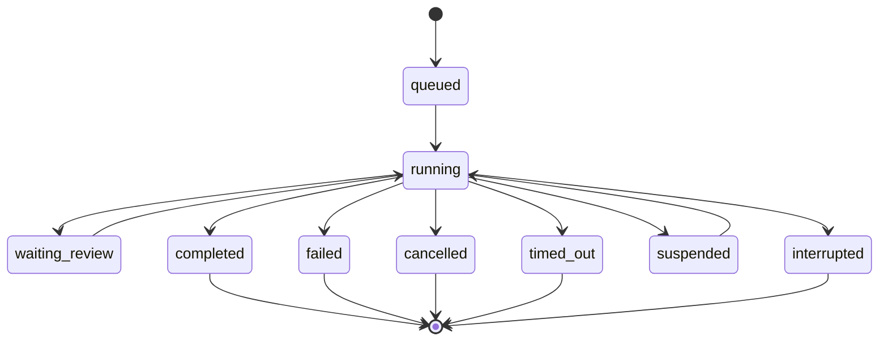

# Run Lifecycle / Wait Contract

Verstak хранит один `agent_runs` ряд на каждый `ai:send`. Для GUI это таймлайн задачи, для headless/CLI это точка синхронизации: можно дождаться финального статуса без чтения UI-стрима.

## Public Status

`RunStatus` живет в `electron/ai/run-lifecycle.ts`:

- `queued`
- `running`
- `waiting_review`
- `completed`
- `failed`
- `cancelled`
- `timed_out`
- `suspended`
- `interrupted`

Текущий storage-статус `done` мапится наружу как `completed`, `stopped` как `cancelled`. Старые storage-статусы сохраняются, чтобы не делать рискованную миграцию таблицы ради переименования.

## State Diagram



## Wait Contract

IPC:

```ts
window.api.ai.wait(runId, { timeoutMs?: number; pollMs?: number })
```

Returns:

```ts
{
  runId: string
  status: RunStatus
  agentRunStatus: AgentRunStatus
  endedAt: number | null
  error: string | null
}
```

Behavior:

- resolves only when the run has `endedAt` or a terminal storage status;
- rejects if `runId` is missing or unknown;
- rejects on timeout;
- does not create, stop, resume, or mutate the run.

This is intentionally a small polling primitive over the existing `agent_runs` storage. It does not replace the GUI event stream and does not introduce a new run engine.
