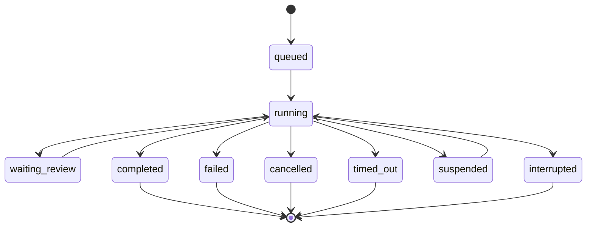

# Run Lifecycle / Wait Contract

Verstak хранит один `agent_runs` ряд на каждый `ai:send`. Для GUI это таймлайн задачи, для headless/CLI это точка синхронизации: можно дождаться финального статуса без чтения UI-стрима.

## Public Status

`RunStatus` живет в `electron/ai/run-lifecycle.ts`:

- `queued`
- `running`
- `waiting_review`
- `completed`
- `failed`
- `cancelled`
- `timed_out`
- `suspended`
- `interrupted`

Текущий storage-статус `done` мапится наружу как `completed`, `stopped` как `cancelled`. Старые storage-статусы сохраняются, чтобы не делать рискованную миграцию таблицы ради переименования.

## State Diagram


```mermaid
stateDiagram-v2
  [*] --> queued
  queued --> running
  running --> waiting_review
  waiting_review --> running
  running --> completed
  running --> failed
  running --> cancelled
  running --> timed_out
  running --> suspended
  running --> interrupted
  suspended --> running
  completed --> [*]
  failed --> [*]
  cancelled --> [*]
  timed_out --> [*]
  interrupted --> [*]
```

## Wait Contract

IPC:

```ts
window.api.ai.wait(runId, { timeoutMs?: number; pollMs?: number })
```

Returns:

```ts
{
  runId: string
  status: RunStatus
  agentRunStatus: AgentRunStatus
  endedAt: number | null
  error: string | null
}
```

Behavior:

- resolves only when the run has `endedAt` or a terminal storage status;
- rejects if `runId` is missing or unknown;
- rejects on timeout;
- does not create, stop, resume, or mutate the run.

This is intentionally a small polling primitive over the existing `agent_runs` storage. It does not replace the GUI event stream and does not introduce a new run engine.

## Runtime Timeout Policy

`ai:send` arms a watchdog for every run. The timeout value is resolved in this order:

1. setting `agent_run_timeout_ms`;
2. env `VERSTAK_AGENT_RUN_TIMEOUT_MS`;
3. default `30 min`.

The policy is clamped to a safe range (`30s..6h`). When the watchdog fires, it writes `agent_runs.status='timed_out'`, appends a timeout event, emits a chat error, and aborts the shared run `AbortController`. The runner then unwinds normally, but `agentRuns.finish()` is idempotent, so the later abort cleanup cannot overwrite the `timed_out` terminal state.

## Plan approval waits outside the run (VSK-TASK-FLOW-A1 §10)

A run that proposes a plan does **not** block waiting for the human decision.
`create_plan` persists the plan, links it to the run via `plans.agent_run_id`,
emits the approval card and returns immediately; the run then finishes normally
and the watchdog above is disarmed with it. A plan left pending for hours can no
longer die of `agent_run_timeout_ms`.

The wait itself is durable state, not a live promise: plan row in `draft` plus
the run's checkpoint. `runner-finalize` keeps the checkpoint of a run that left a
plan awaiting approval (normally a clean `completed` run drops it), because that
checkpoint is where execution resumes.

On approve, `plans:resolve-approval` returns a continuation (`text`,
`resumeFromRunId`, `agentMode`) and the renderer sends it as a normal `ai:send`
with checkpoint replay — history is not rebuilt. On reject the plan becomes
`cancelled` and the checkpoint is released. While the decision is pending, the
proposing run is demoted to `plan` mode, so `mode-policy.decide` blocks writes
regardless of what the model decides to attempt.
