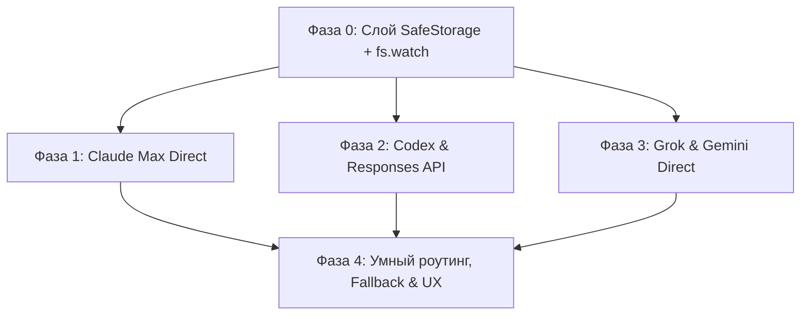

# ЗАДАЧА: убрать «укороченность» CLI-подписок (Claude + Codex + Grok + Gemini) — УСИЛЕННЫЙ ПЛАН

**Дата:** 2026-07-10 · **Тип:** архитектурная доработка · **Связи:** `docs/CLI_SUBSCRIPTIONS_PLAN_1.9.3-1.9.5.md` §6, `TASK-CLI-DEEP-INTEGRATION.md`

---

## 1. Резюме аудита и ключевые находки

В ходе технического аудита окружения были детально исследованы структуры файлов авторизации CLI-провайдеров на реальной системе:

*   **Claude Code** (`~/.claude/.credentials.json`): данные лежат в блоке `claudeAiOauth` (`accessToken`, `refreshToken`, `expiresAt`).
*   **Codex CLI** (`~/.codex/auth.json`): токен лежит в блоке `tokens` (`access_token`, `refresh_token`, `account_id`). Поле `account_id` даёт нам готовый `chatgpt-account-id` заголовок.
*   **Grok Build** (`~/.grok/auth.json`): данные лежат под динамическим ключом вида `https://auth.x.ai::<CLIENT_ID>`. Содержит `key` (OAuth access token), `refresh_token`, `expires_at`. **Grok подписка работает по OAuth, а не статичному API-ключу**, что накладывает те же ToS-риски и требования к обновлению токенов, что и у Claude/Codex.
*   **Gemini CLI** (`~/.gemini/oauth_creds.json`): стандартный Google OAuth блок (`access_token`, `refresh_token`, `expiry_date`).

Перевод всех четырёх провайдеров на direct-API полностью реализуем, но требует решения проблем со сроком жизни токенов (expires_at) и ToS-детекцией.

---

## 2. Архитектурные усиления плана

Для минимизации ToS-рисков, исключения поломок при обновлении OAuth-серверов вендоров и обеспечения бесперебойной работы Verstak внедряются следующие решения:

### Усиление 1: Гибридный механизм обновления токенов (Hybrid Token Refresh)
*   **Механика:** Вместо реализации сложной логики рефреша (которая требует хардкода специфичных client_id/endpoints каждого вендора и ломается при их смене), Verstak использует **фоновый вызов официального CLI**.
*   **Алгоритм:**
    1.  При получении ошибки `401 Unauthorized` от API или если `expires_at` токена истекает в течение 10 минут, Verstak запускает легковесную команду CLI (например, `claude status`, `codex projects list` или `grok auth status`) в фоновом режиме.
    2.  Бинарник CLI выполняет штатную процедуру OAuth-обмена и сохраняет обновленные токены в файл на диске.
    3.  Verstak считывает новые данные из файла, сохраняет их в `SafeStorage` и повторяет упавший API-запрос.
*   **Прямой рефреш (Fallback):** Если запуск CLI не удался, выполняется прямой POST-запрос на OAuth-эндпоинт провайдера с использованием `refresh_token`.

### Усиление 2: Выделенный Responses API адаптер для Codex
*   ChatGPT Plus/Pro подписка через Codex использует непубличный эндпоинт Responses API (`v1/responses`).
*   Внедряется адаптер `electron/ai/codex-responses-adapter.ts`, который:
    *   Формирует специфичный JSON-запрос (с массивом сообщений `input`, полем `response_mode: "stream"` и заголовками `OpenAI-Beta: responses-v1`, `chatgpt-account-id: <account_id>`).
    *   Разбирает SSE-события `response.delta` и транслирует их в стандартные события `ChatEvent` для Verstak.

### Усиление 3: Маскировка TLS и HTTP-заголовков (Anti-Fingerprinting)
*   Для минимизации детекции со стороны Cloudflare/Akamai, все прямые HTTP-запросы маскируются под официальные CLI-клиенты.
*   Устанавливаются аутентичные `User-Agent` (например, `claude-cli/<version> node/<node_version>`) и точные наборы HTTP-заголовков.
*   При необходимости настраивается TLS-конфигурация (ALPN, ciphers) Node.js клиента для симуляции отпечатка официального бинарника.

### Усиление 4: Автоматический Fallback на Headless CLI
*   Если direct-API запрос падает по причине сетевой блокировки, изменений на серверах провайдера или ToS-фильтрации, Verstak автоматически перенаправляет поток на классический запуск CLI (`spawn` с флагами `--print` / `exec` / `-p`).
*   В UI выводится мягкое предупреждение о переключении на режим эмуляции, обеспечивая непрерывность сессии разработчика.

---

## 3. Пошаговый план реализации (Reinforced Road Map)

### Фаза 0: Хранение и слежение (S)
*   Добавить `fs.watch` на credentials-файлы в домашней директории для отслеживания логинов/логаутов из терминала.
*   Реализовать сохранение считанных токенов в `SafeStorage` с привязкой к таблице `cli_accounts`.
*   Добавить токены в черный список `secret-scanner.ts`, чтобы они никогда не попадали в текстовые логи.

### Фаза 1: Claude Max (M)
*   **Сетевой слой:** Добавить в `claude.ts` поддержку авторизации через `Authorization: Bearer <token>` и заголовка `anthropic-beta: oauth-2025-04-20`.
*   **Рефреш:** Реализовать фоновый запуск `claude status` для обновления токена по сигналу 401.
*   **TDD:** Покрыть юнит-тестами разбор `.credentials.json` и формирование заголовков.

### Фаза 2: Codex & ChatGPT (L)
*   **Адаптер:** Создать `codex-responses-adapter.ts` для преобразования запросов Verstak под формат OpenAI Responses API.
*   **Сессия:** Использовать `access_token` и `chatgpt-account-id` из `.codex/auth.json`.
*   **Рефреш:** Реализовать фоновый запуск `codex projects list` для авто-обновления сессии.

### Фаза 3: Grok & Gemini (M)
*   **Grok:** Парсить `.grok/auth.json` с поиском динамического OIDC-ключа, передавать извлеченный токен `key` в `grok.ts` в заголовке `Authorization: Bearer`. Рефреш через фоновый `grok auth status`.
*   **Gemini:** Перевести `gemini.ts` на OAuth-токен из `.gemini/oauth_creds.json`.
*   **Маскировка:** Внедрить аутентичные `User-Agent` для всех запросов.

### Фаза 4: Умный роутинг и Fallback (S)
*   Интегрировать авто-переключение на headless CLI при сетевых сбоях direct-API.
*   Добавить статус-индикацию типа подключения в интерфейс Verstak.
*   Провести сквозные тесты ротации аккаунтов (совместно с логикой 1.9.4).

---

## 4. Критерии готовности (Done)

- [ ] Все 4 подписки (Claude, Codex, Grok, Gemini) работают по direct-API через наш агентский цикл (доступны MCP, живой таймлайн, аттачменты).
- [ ] Токены шифруются в `SafeStorage`, утечки в логи исключены.
- [ ] Токены авто-обновляются в фоновом режиме (посредством вызовов CLI-помощников), долгие сессии не прерываются.
- [ ] При блокировке API-запросов происходит бесшовное переключение на эмуляцию CLI (headless fallback).
- [ ] Тесты `npm run test` проходят успешно, сборка проекта не нарушена.
